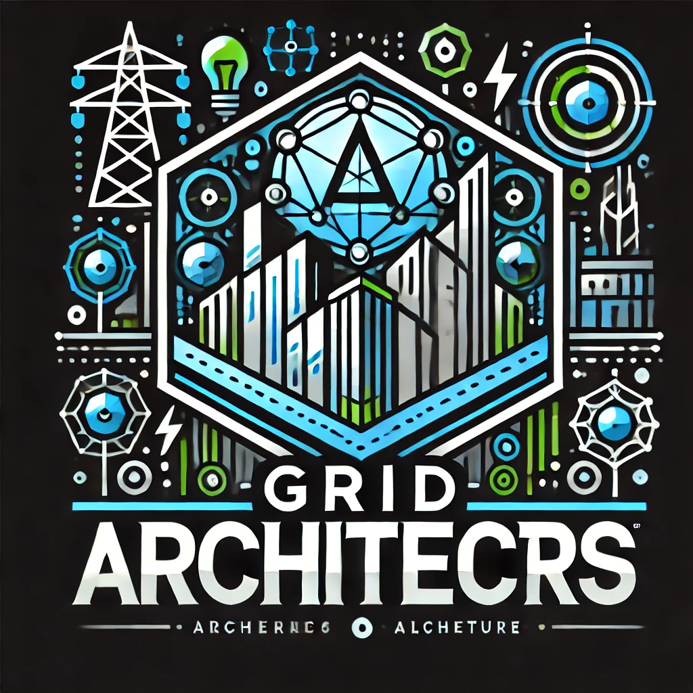

<!-- Improved compatibility of back to top link: See: https://github.com/othneildrew/Best-README-Template/pull/73 -->

<!--
*** Thanks for checking out the Best-README-Template. If you have a suggestion
*** that would make this better, please fork the repo and create a pull request
*** or simply open an issue with the tag "enhancement".
*** Don't forget to give the project a star!
*** Thanks again! Now go create something AMAZING! :D
-->

<!-- PROJECT SHIELDS -->
<!--
*** I'm using markdown "reference style" links for readability.
*** Reference links are enclosed in brackets [ ] instead of parentheses ( ).
*** See the bottom of this document for the declaration of the reference variables
*** for contributors-url, forks-url, etc. This is an optional, concise syntax you may use.
*** https://www.markdownguide.org/basic-syntax/#reference-style-links
-->
[![Contributors][contributors-shield]][contributors-url]
[![Forks][forks-shield]][forks-url]
[![Stargazers][stars-shield]][stars-url]
[![Issues][issues-shield]][issues-url]
[![MIT License][license-shield]][license-url]

<!-- PROJECT LOGO -->
 

  

<h3 align="center">Grid Architects</h3>

  

    Design the future, one connection at a time. Android GameConsists of an API to make the job of scheduling classes in the Regibox app easier.
     
    <a href=""><strong>Explore the game</strong></a>
     
     
    <!-- <a href="https://youtu.be/vULnTanHHmM">View Demo</a>
    · -->
    <a href="https://github.com/andrefdre/Grid-Architects/issues">Report Bug</a>
    ·
    <a href="https://github.com/andrefdre/Grid-Architects/issues">Request Feature</a>
  

<!-- TABLE OF CONTENTS -->

  
Table of Contents

  <ol>
    <li>
      <a href="#about-the-project">About The Project</a>
    </li>
    <li>
      <a href="#getting-started">Getting Started</a>
      <ul>
        <li><a href="#prerequisites">Prerequisites</a></li>
        <li><a href="#installation">Installation</a></li>
      </ul>
    </li>
    <li><a href="#usage">Usage</a></li>
    <li><a href="#contributing">Contributing</a></li>
    <li><a href="#license">License</a></li>
    <li><a href="#contact">Contact</a></li>
    <li><a href="#acknowledgments">Acknowledgments</a></li>
  </ol>

<!-- ABOUT THE PROJECT -->
## About The Project

Design the future, one connection at a time. Android Game

(<a href="#readme-top">back to top</a>)

### Built With

* [![Unity][Unity.com]][Unity-url]
* [![C#][CSharp.com]][CSharp-url]
* [![Multiplayer][Multiplayer.com]][Multiplayer-url]
* [![Real-Time Data][RealTimeData.com]][RealTimeData-url]

(<a href="#readme-top">back to top</a>)

<!-- GETTING STARTED -->
## Getting Started

### Prerequisites

### Installation

(<a href="#readme-top">back to top</a>)

<!-- USAGE EXAMPLES -->
## Usage

(<a href="#readme-top">back to top</a>)

<!-- CONTRIBUTING -->
## Contributing

If you have a suggestion that would make this better, please fork the repo and create a pull request. You can also simply open an issue with the tag "enhancement".
Don't forget to give the project a star! Thanks again!

1. Fork the Project
2. Create your Feature Branch (`git checkout -b feature/AmazingFeature`)
3. Commit your Changes (`git commit -m 'Add some AmazingFeature'`)
4. Push to the Branch (`git push origin feature/AmazingFeature`)
5. Open a Pull Request

(<a href="#readme-top">back to top</a>)

<!-- LICENSE -->
## License

Distributed under the GPL License. See `LICENSE.txt` for more information.

(<a href="#readme-top">back to top</a>)

<!-- CONTACT -->
## Contact

André Cardoso - andref@ua.pt

Project Link: [Grid Architects](https://github.com/andrefdre/Grid-Architects)

(<a href="#readme-top">back to top</a>)

<!-- MARKDOWN LINKS & IMAGES -->
<!-- https://www.markdownguide.org/basic-syntax/#reference-style-links -->
[contributors-shield]: https://img.shields.io/github/contributors/andrefdre/Grid-Architects.svg?style=for-the-badge
[contributors-url]: https://github.com/andrefdre/Grid-Architects/graphs/contributors
[forks-shield]: https://img.shields.io/github/forks/andrefdre/Grid-Architects.svg?style=for-the-badge
[forks-url]: https://github.com/andrefdre/Grid-Architects/network/members
[stars-shield]: https://img.shields.io/github/stars/andrefdre/Grid-Architects.svg?style=for-the-badge
[stars-url]: https://github.com/andrefdre/Grid-Architects/stargazers
[issues-shield]: https://img.shields.io/github/issues/andrefdre/Grid-Architects.svg?style=for-the-badge
[issues-url]: https://github.com/andrefdre/Grid-Architects/issues
[license-shield]: https://img.shields.io/github/license/andrefdre/Grid-Architects.svg?style=for-the-badge
[license-url]: https://github.com/andrefdre/Grid-Architects/blob/master/LICENSE.txt
[product-screenshot]: Docs/logo.svg

[Unity.com]: https://img.shields.io/badge/Unity-000000?style=for-the-badge&logo=unity&logoColor=white
[Unity-url]: https://unity.com/

[CSharp.com]: https://img.shields.io/badge/C%23-239120?style=for-the-badge&logo=c-sharp&logoColor=white
[CSharp-url]: https://learn.microsoft.com/en-us/dotnet/csharp/

[Multiplayer.com]: https://img.shields.io/badge/Multiplayer-008080?style=for-the-badge&logo=gamepad&logoColor=white
[Multiplayer-url]: https://unity.com/solutions/multiplayer

[RealTimeData.com]: https://img.shields.io/badge/Real--Time%20Data-1E90FF?style=for-the-badge&logo=database&logoColor=white
[RealTimeData-url]: https://example.com/realtime-data
